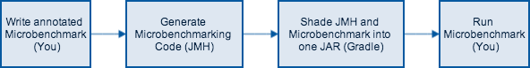

# Image Component Labeling Using Apache Spark

Idea: rephrase problem into graph and use graphx connected component search to label components in a distributed (sparky) manner.

# Spark Graph API pointers

https://spark.apache.org/docs/latest/graphx-programming-guide.html#connected-components


# ImgLib2 API pointers

[Image Open & Display](https://imagej.net/ImgLib2_-_Getting_Started)

[Accessors & Cursors](https://imagej.net/ImgLib2_-_Accessors#Cursor)


```
ImagePlusImg image = ImagePlusAdapter.wrap(img);
Img<UnsignedByteType> image = ImageJFunctions.wrap(img);
```

try ops http://mvnrepository.com/artifact/net.imagej/imagej-ops/0.38.0

Example image after enhance contrasts


# Benchmarking

Available Libs
* https://scalameter.github.io/
* jmh http://www.baeldung.com/java-microbenchmark-harness --> Seems better


`@State` Model
> When multiple {@link Param}-s are needed for the benchmark run,
 JMH will compute the outer product of all the parameters in the run.

run with json as outformat
```
com.github.holgerbrandl.spark.misc.ExampleBenchmark.init  -rf json -rff results.csv
```

csv provided error is 99.9 CI

if execution plan is injected into benchmark method --> traverse state outer product

Run with
```bash
cd /Users/brandl/projects/spark/component_labeling

#sbt package
#appJar=/Users/brandl/projects/spark/component_labeling/target/scala-2.11/component_labeling_2.11-0.1.jar
#ll $appJar
#java -jar "target/scala-2.11/component_labeling_2.11-0.1.jar"
# -> won't work without a fat jar

## use sbt plugin from https://github.com/ktoso/sbt-jmh
# Write your benchmarks in `src/main/scala`. They will be picked up and instrumented by the plugin.

## run all
sbt 'jmh:run *' ## works if no "extends app" are present in code (see https://github.com/ktoso/sbt-jmh/pull/117#issuecomment-331255198)
#sbt jmh:run -i 3 -wi 3 -f1 -t1 .*FalseSharing.*

# run test benchmark
sbt 'jmh:run -rf json -rff ExampleBenchmark.results.json com.github.holgerbrandl.spark.misc.ExampleBenchmark'

# run local benchmarking
sbt 'jmh:run -rf json -rff threaded_results.json com.github.holgerbrandl.spark.components.ThreadedLabelBM' 

## run truly distributed labeling 
## fur; sparkcluster start  --walltime 05:00 --memory-per-core 2000 100
export SPARK_CLUSTER_URL="spark://localhost:10100"
# test spark cluster connectivity
$SPARK_HOME/bin/spark-shell --master ${SPARK_CLUSTER_URL} 

sbt 'jmh:run -rf json -rff cluster_results.json com.github.holgerbrandl.spark.components.ClusterLabelBenchmark' 

```


# Next Steps

1. fix imglib generics by converting Interval back into byte/int image2

3. Simplify deployment

rebuild using gradle, see https://docs.gradle.org/current/userguide/scala_plugin.html and do profiling with https://github.com/melix/jmh-gradle-plugin which also supports better combined fatjar packaging and thus allow for `java -jar build/libs/benchmarking-experiments-0.1.0-all.jar` which seems to accept args because of https://github.com/danielmitterdorfer/benchmarking-experiments/blob/master/pom.xml#L65



[Source](http://daniel.mitterdorfer.name/img/jmh-workflow.png ) which also uses `gradle shadow` --> sources: https://github.com/danielmitterdorfer/benchmarking-experiments without using jmh-gradle!!

or use mvn archetype as described on http://openjdk.java.net/projects/code-tools/jmh/

```
## jar building: follow advice from http://openjdk.java.net/projects/code-tools/jmh/
cd ~/Desktop/
mvn archetype:generate \
          -DinteractiveMode=false \
          -DarchetypeGroupId=org.openjdk.jmh \
          -DarchetypeArtifactId=jmh-scala-benchmark-archetype \
          -DgroupId=org.sample \
          -DartifactId=test \
          -Dversion=1.0
```

## Other References

Array DBs
* http://www.alphadevx.com/a/36-Comparison-of-Relational-and-Multi-Dimensional-Database-Structures
* https://en.wikipedia.org/wiki/Array_DBMS
* http://zachmoshe.com/2015/11/11/random-polygons.html
