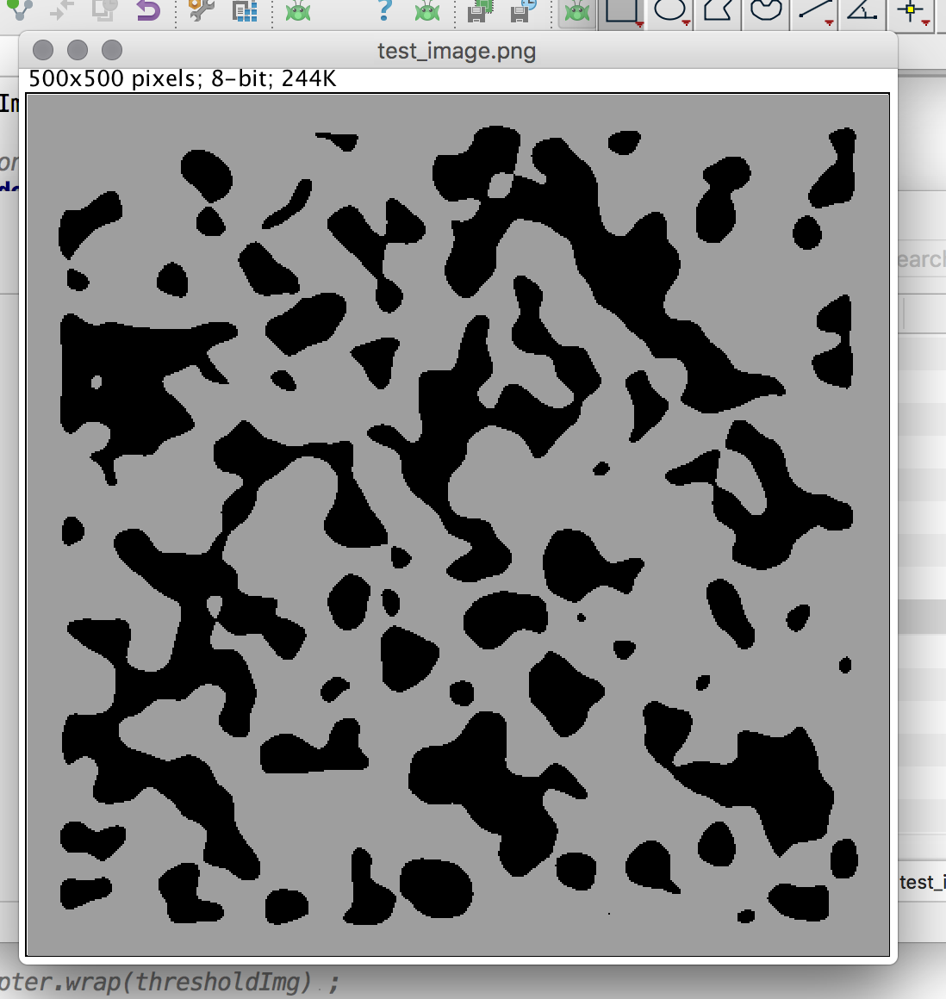

Array DBs
* http://www.alphadevx.com/a/36-Comparison-of-Relational-and-Multi-Dimensional-Database-Structures
* https://en.wikipedia.org/wiki/Array_DBMS

# Spark Graph API pointers


https://spark.apache.org/docs/latest/graphx-programming-guide.html#connected-components


# ImgLib2 API pointers

[Image Open & Display](https://imagej.net/ImgLib2_-_Getting_Started)

[Accessors & Cursors](https://imagej.net/ImgLib2_-_Accessors#Cursor)


# Benchmarking Notes

Example image after enhance contrasts



Libs
* https://scalameter.github.io/
* jmh http://www.baeldung.com/java-microbenchmark-harness


@State Model
> When multiple {@link Param}-s are needed for the benchmark run,
 JMH will compute the outer product of all the parameters in the run.

 run with json as outformat
 ```
 com.github.holgerbrandl.spark.misc.ExampleBenchmark.init  -rf json -rff results.csv
 ```

 csv provided error is 99.9 CI

if execution plan is injected into benchmark method --> traverse state outer product

Run with
```bash
cd /Users/brandl/projects/spark/component_labeling
sbt package
appJar=/Users/brandl/projects/spark/component_labeling/target/scala-2.11/component_labeling_2.11-0.1.jar

java -jar "target/scala-2.11/component_labeling_2.11-0.1.jar"
# sehttp://openjdk.java.net/projects/code-tools/jmh/
```

# Next steps

* fix imglib generics by converting Interval back into byte/int image


